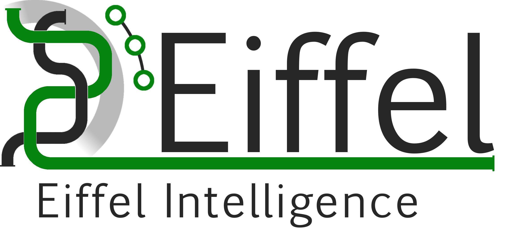

<!---
   Copyright 2017-2018 Ericsson AB.
   For a full list of individual contributors, please see the commit history.

   Licensed under the Apache License, Version 2.0 (the "License");
   you may not use this file except in compliance with the License.
   You may obtain a copy of the License at

       http://www.apache.org/licenses/LICENSE-2.0

   Unless required by applicable law or agreed to in writing, software
   distributed under the License is distributed on an "AS IS" BASIS,
   WITHOUT WARRANTIES OR CONDITIONS OF ANY KIND, either express or implied.
   See the License for the specific language governing permissions and
   limitations under the License.
--->

# Eiffel Intelligence
Eiffel Intelligence is a real time data aggregation and analysis solution for Eiffel events. While Eiffel represents an event based architecture, Eiffel Intelligence addresses the need of stakeholders to view the current state of the system by bridging the divide from immutable events to mutable state representation. 

## Detailed documentation is provided in [the repository wiki](../../wiki).

# About this repository
The contents of this repository are licensed under the [Apache License 2.0](./LICENSE).

To get involved, please see [Code of Conduct](./CODE_OF_CONDUCT.md) and [contribution guidelines](./CONTRIBUTING.md).

# About Eiffel
This repository forms part of the Eiffel Community. Eiffel is a protocol for technology agnostic machine-to-machine communication in continuous integration and delivery pipelines, aimed at securing scalability, flexibility and traceability. Eiffel is based on the concept of decentralized real time messaging, both to drive the continuous integration and delivery system and to document it.

Visit [Eiffel Community](https://eiffel-community.github.io) to get started and get involved.
