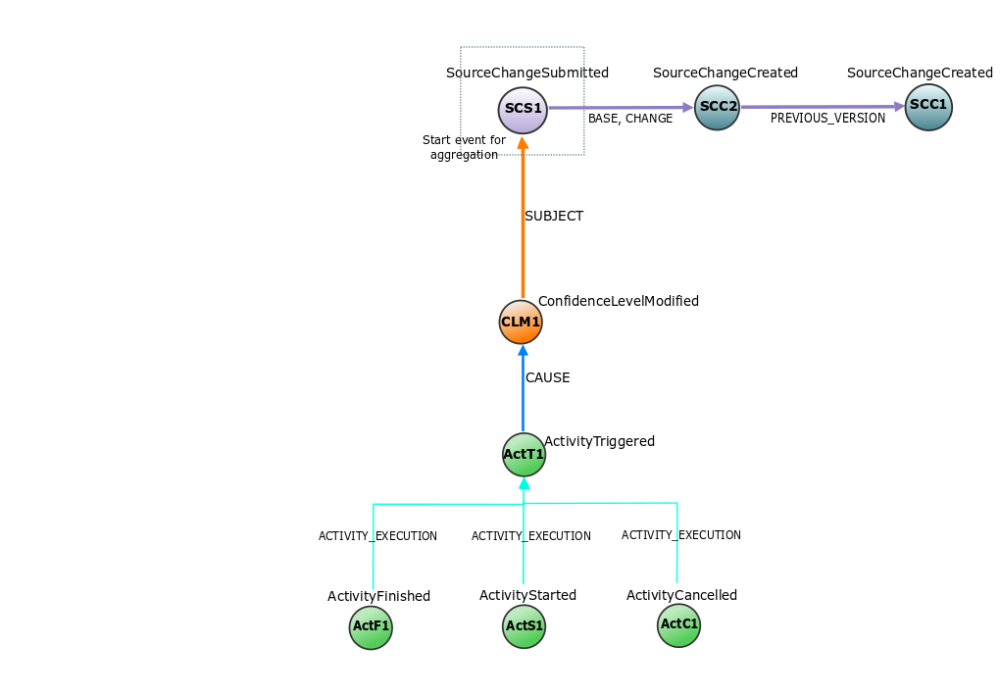

# Example Rules

We have created some example rules that represent use cases which triggered 
the development of Eiffel Intelligence. The files containing the rules 
can be found [**here**](../src/main/resources/rules).

We have also illustrated the Eiffel event flows which these example rules 
need, to perform the aggregation. The illustrations contain the events 
and how they are linked together. 
Any upstream events linked from this are looked up from ER if HistoryRules 
are defined. Following events in the chain which are linked back to the 
ArtifactCreated event will be included in the aggregation, according to
the rules.

## Flow with the Events Required for Artifact Object Flow
The start event for this flow is the ArtifactCreated (ArtC2) event.

</img>

## Flow with the Events Required for SourceChange Object Flow
The start event for this flow is the SourceChangeSubmitted (SCS1) event.

</img>

## Flow with the Events Required for TestExecution Object Flow
The start event for this flow is the ActivityTriggered (ActT) event.

</img>