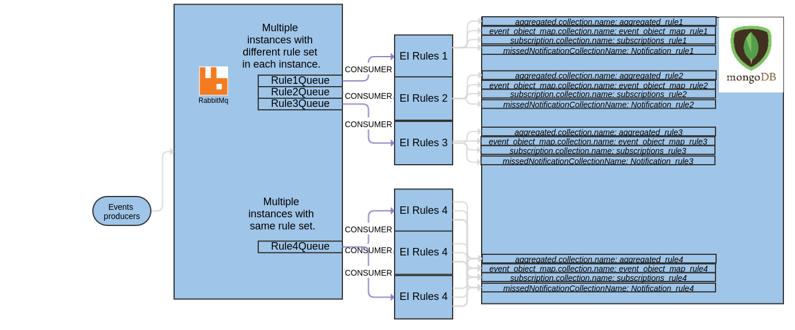
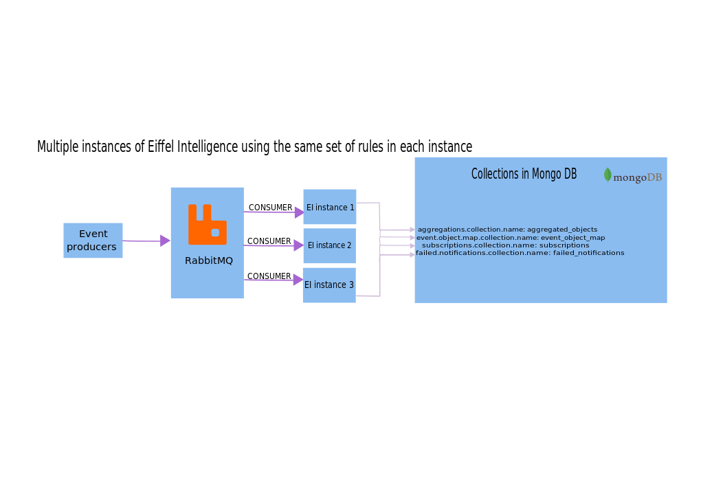

# Configuration

The configuration for RabbitMQ, MongoDB etc. can be set in the [application.properties](https://github.com/eiffel-community/eiffel-intelligence/blob/master/src/main/resources/application.properties) file. You can also set them as system properties using the -D flags when starting Eiffel Intelligence.

## Setting up multiple EI instances

Eiffel Intelligence is designed to be able to collect different information
in different objects. What information to be collected from what events
to what object is configured using a set of rules.

### Set up multiple instances with different rule sets in each instance

In this case we use the same instance of RabbitMQ and MongoDB.

  - **rabbitmq.consumer.name** property should be different for each rule set. Otherwise the rabbitMQ will split the events in the queue among all the instances listening to that queue.
  - MongoDb collection names should also be different for each rule set.

</img>

### Set up multiple instances with same rule set

This situation may be needed when the events throughput is very high. In this case the same configuration file is copied to the server where the extra instance will be started.

</img>

## Configure Eiffel Intelligence with extraction rules for specific Eiffel protocol version

Extraction rules for a specific Eiffel protocol versions is configured by
setting "rules.path" property in [application.properties](https://github.com/eiffel-community/eiffel-intelligence/blob/master/src/main/resources/application.properties)
to point to the correct extraction rules json file.

Eiffel Intelligence provides default extractions rules json files for
different Eiffel protocol versions inside the war artifact file and in the
source code repository. All default extraction rules json files can be
found here: [extraction rules](https://github.com/eiffel-community/eiffel-intelligence/blob/master/src/main/resources/rules)

Example of setting "rules.path" property in application.properties using default extraction rules json files provided in eiffel-intelligence war file:
- rules.path: /rules/ArtifactRules-Eiffel-Agen-Version.json
- rules.path: /rules/ArtifactRules-Eiffel-Toulouse-Version.json
- rules.path: /rules/SourceChangeObjectRules-Eiffel-Toulouse-Version.json

It is possible to use external provided extraction rules by providing the full path or a URI.
URI schemes that are accepted are 'file','http' and 'https'.
Examples of setting "rules.path" property to an external rules file:
- rules.path: /full/path/to/ExtractionRules.json
- rules.path: file:///full/path/to/ExtractionRules.json
- rules.path: file://localhost/full/path/to/ExtractionRules.json
- rules.path: http://somehost.com/full/path/to/ExtractionRules.json
- rules.path: https://somehost.com/full/path/to/ExtractionRules.json

## Define placeholder in rules

If you wish to re-use the extracted value from IdentifyRules field 
somewhere else in your rule set for a particular event, it is possible 
to define a placeholder marker. Eiffel Intelligence will find and replace 
this marker in your rules with the wanted value extracted from IdentifyRules. 
This marker can be defined with the property **rules.replacement.marker**. 
You can see example usages of it in the [example rules](https://github.com/eiffel-community/eiffel-intelligence/tree/master/src/main/resources/rules) 
and [read more about it's usage here](https://github.com/eiffel-community/eiffel-intelligence/blob/master/wiki/markdown/rules.md#using-placeholders-in-rules).

## Configuring aggregations

Eiffel Intelligence saves aggregated objects in a database. It is possible
to configure the collection name, the time to live and the name of the
aggregated object using the below properties:

* aggregations.object.name
* aggregations.collection.name

If Eiffel Intelligence is set up with [AllEventRules](https://github.com/eiffel-community/eiffel-intelligence/blob/master/src/main/resources/AllEventsRules-Eiffel-Agen-Version.json)
it is recommended to set a time to live value on the aggregated objects, 
to avoid having the collection growing too large. Recommended settings is 10 minutes.

* aggregations.collection.ttl (*seconds*)

### Testing aggregation rules

To test new rules for Eiffel Intelligence the property **test.aggregation.enabled**
can be set to true. This gives users the possibility to try out different rule sets
on a specific set of Eiffel events and see the resulting aggregated object.

### Wait list

If Eiffel Intelligence receives events that are not connected to any
existing aggregated objects, and it is not declared as start event in the
rules, the event is stored in the wait list database for a while. The
"time-to-live" value limits how long an event is stored in the wait list.

* waitlist.collection.name
* waitlist.collection.ttl (*seconds*)

It is possible to configure how often Eiffel Intelligence should handle
unprocessed events lying in the wait list. These properties are in **milliseconds**:

* waitlist.resend.initial.delay (*milliseconds*)
* waitlist.resend.fixed.rate (*milliseconds*)

## Subscriptions

Eiffel Intelligence stores subscriptions in a database with the collection
name configured with the property **subscriptions.collection.name**. When
subscriptions have fulfilled their requirements and notifications
should not be repeated, the subscription is stored together with the
matched aggregated object in the database. The name of this particular
collection is defined by the below property:

* subscriptions.collection.name
* subscriptions.repeat.handler.collection.name

### Notifications

**email.sender** defines who should be the sender of the email Eiffel
Intelligence sends when a subscription is triggered. If a subscription is
defined with the notificationMeta "receivermail@example.com" this receiver
would be notified when the subscription fulfills all conditions via an e-mail.
The sender of this e-mail is defined by the **email.sender** property.
The value for "email.subject" is used by all subscriptions which have been
created via the REST API. When a subscription is created using the Eiffel
Intelligence front-end GUI it is possible to set individual e-mail subject
for each subscription. Note that these two properties are mandatory to set.

* email.sender
* email.subject

### Failed notifications

Should the subscription notification for some reason fail. It is possible to configure
what the collection name for failed notifications should be in the property
**failed.notifications.collection.name**. **failed.notifications.collection.ttl** tells
Eiffel Intelligence how long a failed notification will be stored in the
database before deletion. With **notification.retry** property, it
is possible to configure the number of attempts Eiffel Intelligence will
retry to make a REST POST notification when a subscription is triggered.

* failed.notifications.collection.name
* failed.notifications.collection.ttl
* notification.retry

### Configure search in Event repository

For Eiffel Intelligence to search for linked events Event repository is
used. **er.url** takes a full URL to such a repository.

* er.url

## Security

### LDAP

You can set up authentication for CRUD operations on subscriptions by configuring
the LDAP settings.
Multiple LDAP servers can be configured. The priority is in the order they are written.
This means that authentication will first be tried on the first defined LDAP and if that
fails the second will be tried and so on. LDAP is enabled with the **ldap.enabled** property
and the settings are defined in the **ldap.server.list** property.

    ldap.enabled: true
    ldap.server.list: [\
        {\
            "url": "ldaps://first.com:369",\
            "base.dn": "dc=first,dc=com",\
            "username": "cn=admin,dc=first,dc=com",\
            "password": "YWRtaW4=",\
            "user.filter": "uid={0}"\
        },\
        {\
            "url": "ldap://second:389/dc=example,dc=org",\
            "base.dn": "",\
            "username": "",\
            "password": "",\
            "user.filter": "uid={0}"\
        }\
    ]\

## Password encryption

In a production environment and filesystems, administrator most likely don't want to store passwords in clear text.

These Eiffel Intelligence password properties can be provided encrypted:

        rabbitmq.password
        spring.data.mongodb.password

A password property is configured by providing the encrypted password in this format.

        some.component.password=ENC(myEncryptedPassword)

Ldap encrypted password is set inside **ldap.server.list** property according the example below:

    ldap.server.list=[{\
        "url": "<ldap address>",\
        "base.dn": "<dn>",\
        "username": "<username>",\
        "password": "ENC(myEncryptedPassword)",\
        "user.filter": "<filter>"\
    }]

How and examples of how to encrypt passwords can be found on Jasypt homepage.
On Jasypt homepage encrypt.sh script can be downloaded, which can be used to encrypt passwords:

http://www.jasypt.org/cli.html

Short guide about encrypting passwords:

**1** Encrypt actual component password with secret encrypting password.
Encrypting password should be a secret password and is created/generated by administator user and should not be written/stored in application.properties or any other config files near the application in the filesystem:

        ./encrypt.sh input="<the actual component password>" password=mySecretEncryptorPassword

**2** That above step will generate the encrypted component password, example:

        rv/2O+hOT4GJSPmmF/cF1w==

**3** Now open application.properties file and add the new encrypted password to the specific component password property with "ENC(myEncryptedPassword)" format:

         some.component.password=ENC(rv/2O+hOT4GJSPmmF/cF1w==)

Do step 1 to 3 for all component passwords and properties in application.properties. Remember to use same secret encryptor password for all components passwords.

**4** Now its time to run Eiffel-Intelligence with these encrypted passwords in application.properties.
Eiffel-Intelligence will decrypt password properties with help of the provided secret encryptor password at run-time.
Execute Eiffel-Intelligence with "jasypt.encryptor.password=mySecretEncryptorPassword" flag, example:

        java -jar eiffel-intelligence-<version>.war --jasypt.encryptor.password=mySecretEncryptorPassword --spring.config.location=/path/to/application.properties
