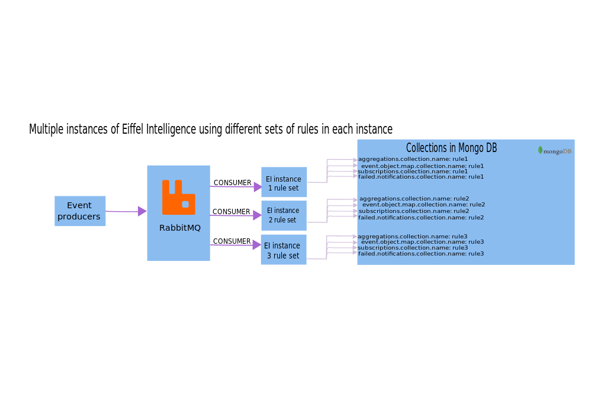

# Configuration

Address and port for message buss and MongoDB needs to be configured in 
[application.properties](https://github.com/Ericsson/eiffel-intelligence/blob/master/src/main/resources/application.properties) 
for the application to run properly.

Each property is explained in the file so open the properties file for a view 
on properties role.

## Setting up multiple EI instances

Eiffel intelligence is designed to be able to collect different information in different objects. What information to be collected from what events to what object is configured using a set of rules.

### Set up multiple instances with different rule sets in each instance

In this case we use the same instance of Rabbitmq and MongoDb.

  - rabbitmq.consumerName property should be different for each rule set. Otherwise the rabbitmq will split the events in the queue among all the instances listening to that queue
  - MongoDb collection names should also be different for each rule set
  
  
</img>
  
### Set up multiple instances with same rule set

This situation may be needed when the events throughput is very high. In this case the same configuration file is copied to the server where the extra instance will be started.   
  
  
</img>
  
### Confiure Eiffel-Intelligence and Extraction Rules for specific Eiffel protocol versions

Extraction Rules for specific Eiffel protocol versions is counfigured by setting "rules.path" in [application.properties](https://github.com/Ericsson/eiffel-intelligence/blob/master/src/main/resources/application.properties) to point to correct Extraction rules json file.

Eiffel-Intelligence provides default extractions rules json files for different Eiffel protocol versions inside the war artifact file and in the source code repository.
All default extraction rules json files can be found here: [ExtractionRules](https://github.com/Ericsson/eiffel-intelligence/blob/master/src/main/resources/rules) 

Example of setting "rules.path" property in application.properties using default extraction rules json files provided in eiffel-intelligence war file:
- rules.path: /rules/ArtifactRules-Eiffel-Agen-Version.json
- rules.path: /rules/ArtifactRules-Eiffel-Toulouse-Version.json
- rules.path: /rules/SourceChangeObjectRules-Eiffel-Toulouse-Version.json

It is possible to use external provided extraction rules by providing full path to the extraction rules json file:
- rules.path: /full/path/to/ExtractionRules.json
