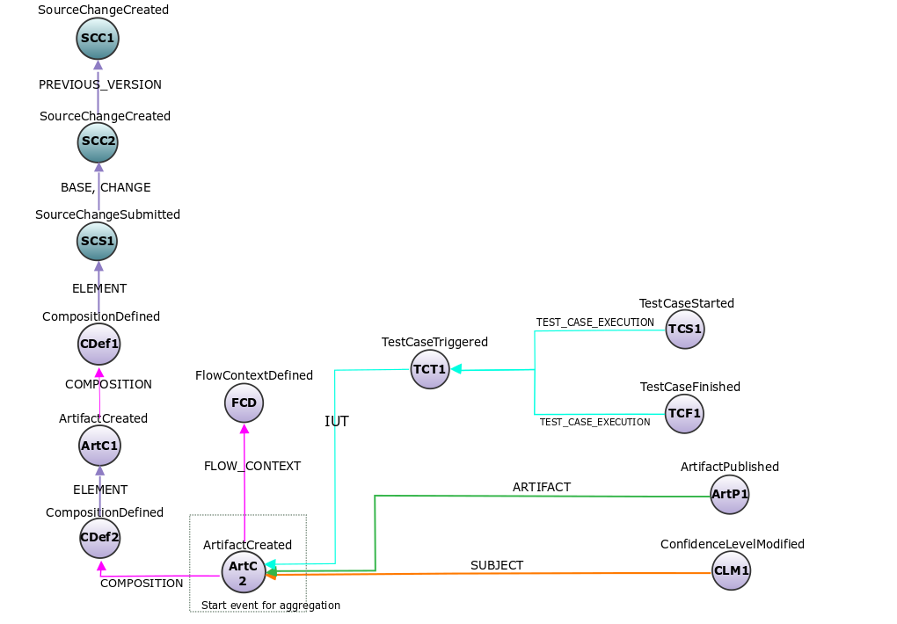
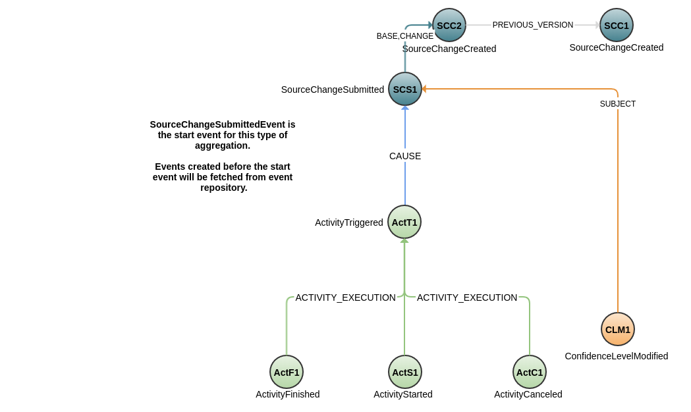
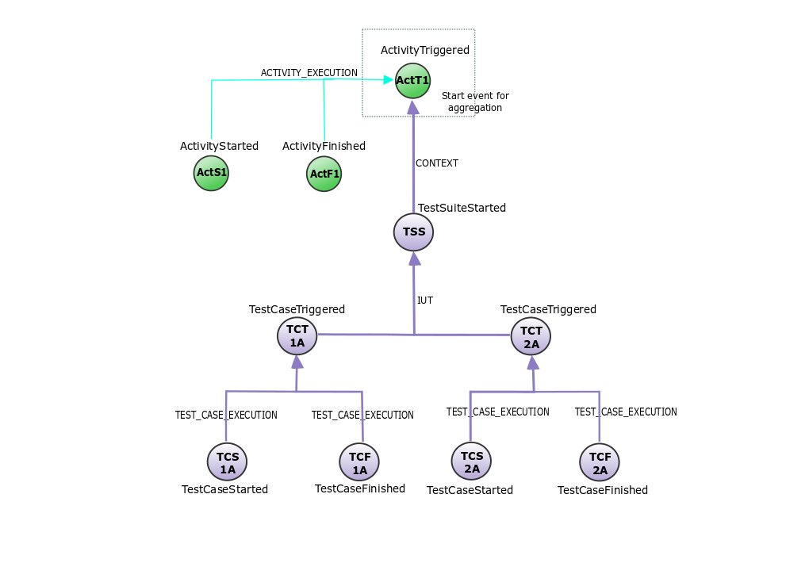

# Example rules

We have created some example rules that represent use cases which triggered 
the development of Eiffel Intelligence. The files containing the rules 
can be found [**here**](https://github.com/eiffel-community/eiffel-intelligence/tree/master/src/main/resources/rules).

We have also illustrated the Eiffel event flows which these example rules 
need, to perform the aggregation. The illustrations contain the events 
and how they are linked together.

## Flow with the events required for Artifact object flow.

</img>

## Flow with the events required for SourceChange object flow.

</img>

## Flow with the events required for TestExecution object flow.

</img>